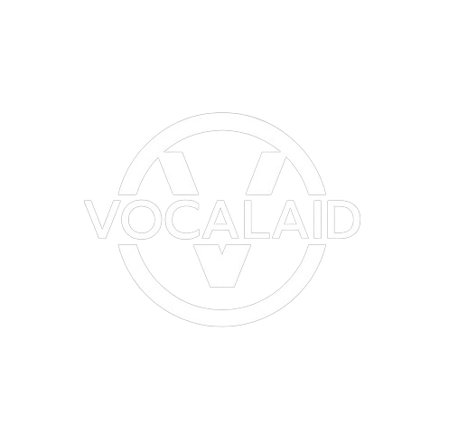
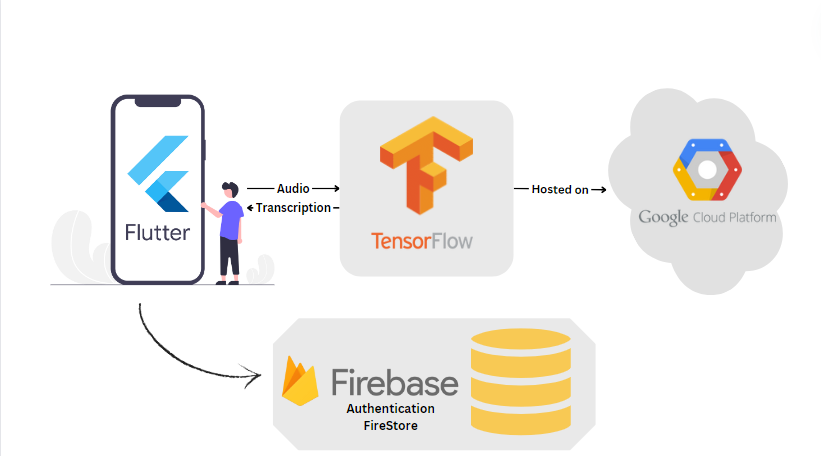
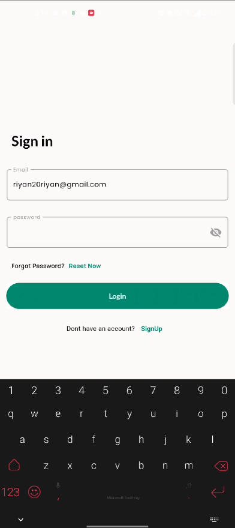
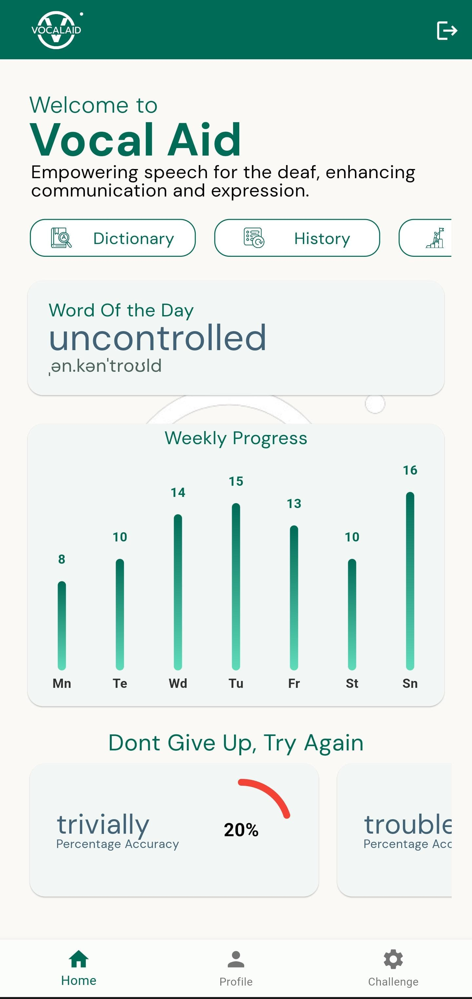
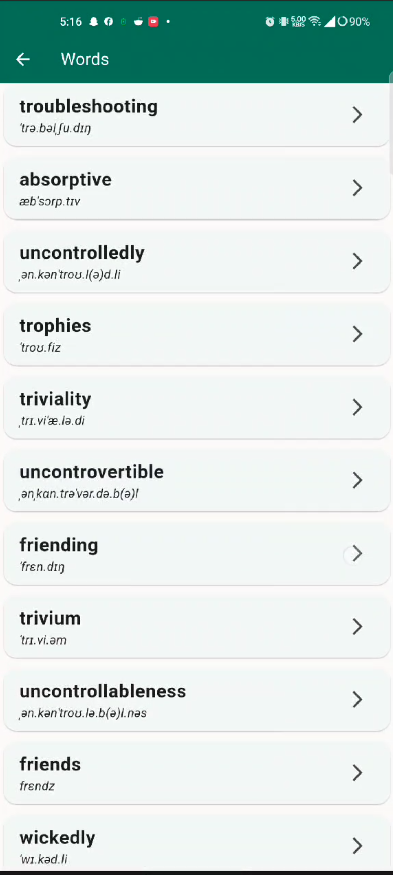
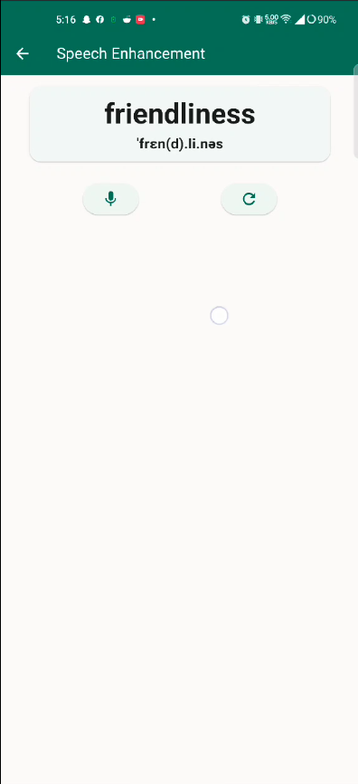
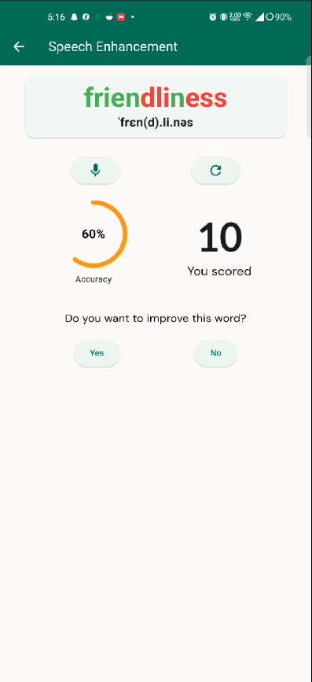
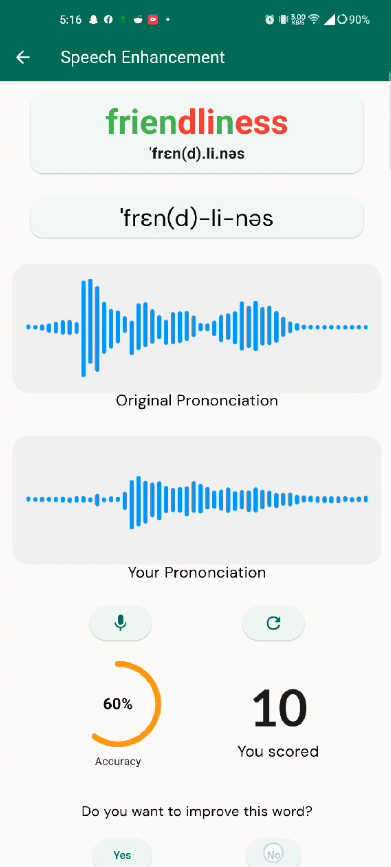

  

<h2 align="center"><b>VocalAid</b></h2>

Empowering Voices, Bridging Silences.

## Table of Contents
1. [Project Overview](#project-overview)
2. [Goals](#goals)
3. [Project Architecture](#project-architecture)
4. [Model Training](#model-training)
    - [Dataset](#dataset)
    - [Training Roadmap](#training-roadmap)
5. [User Guide](#user-guide)
6. [Future Goals](#future-goals)
   

## Project Overview

### What is the Problem

For many in the deaf community, mastering pronunciation can be a significant challenge due to the limited feedback on their speech production. Traditional methods of speech training often require extensive interaction with speech therapists, which can be costly and not always accessible. Furthermore, the feedback loop in learning pronunciation is crucial; without the ability to hear their own voice, deaf individuals may struggle to correct and refine their speech patterns. This situation underscores a broader issue of inclusivity and accessibility in speech training resources.

### Our Solution to it

VocalAid aims to bridge this gap by leveraging technology to provide an innovative solution. Our application is designed to assist deaf individuals in improving their pronunciation through interactive feedback. Here’s how we address the problem:

- **Immediate Feedback**: Using advanced speech recognition technology, VocalAid provides real-time feedback on pronunciation, allowing users to adjust and practice their speech instantaneously.
- **Visual Learning**: The app breaks down words into syllables and displays visual cues, making it easier for users to understand and mimic the correct pronunciation.
- **Customized Learning Paths**: Based on the user's progress, VocalAid customizes the learning experience, focusing on areas that need improvement, thus making the learning process more efficient and effective.
- **Accessible Anywhere**: By creating a mobile application, we ensure that our solution is accessible to anyone with a smartphone, overcoming the barrier of needing to be physically present at a speech therapy session.

Through VocalAid, we aspire to empower individuals with hearing impairments by providing them with the tools they need to improve their speech autonomously, fostering greater independence and confidence in their communication abilities.

## Goals

Our project aligns with the United Nations Sustainable Development Goals (SDGs), focusing on three critical areas:

- **Quality Education**: Enhancing access to inclusive educational resources and lifelong learning opportunities.
- **Reduced Inequalities**: Addressing disparities and enabling equitable access to technology and resources.
- **Peace, Justice, and Strong Institutions**: Contributing to the creation of inclusive societies with equal opportunities for all.

<table align="center" style="width:50%;">
  <tr>
    <td align="center" valign="middle">
      <figure>
        
      </figure>
    </td>
    <td align="center" valign="middle">
      <figure>
        
      </figure>
    </td>
    <td align="center" valign="middle">
      <figure>
        
      </figure>
    </td>
  </tr>
</table>

## Project Architecture

- **Flutter**: For cross-platform mobile application development.
- **Firebase**: For secure data storage and user authentication.
- **TensorFlow**: For fine-tuning speech recognition models.
- **Google Cloud**: For hosting our services with high availability.

## Model Training

### Dataset

To train our speech recognition models, we've secured a dataset from the pivotal research titled "Corpus of deaf speech for acoustic and speech production," which can be found [here](https://pubs.aip.org/asa/jasa/article/142/1/EL102/662623/Corpus-of-deaf-speech-for-acoustic-and-speech). Provided by Dr. Lisa Lucks Mendel of the University of Memphis, this dataset aligns seamlessly with our project's aims, offering an array of speech samples vital for our tool.

Owing to confidentiality agreements, we are unable to distribute this dataset. Those interested in accessing the dataset may request permission by reaching out to the original authors.

### Training Roadmap
- **Preprocessing**: Cleaning and formatting the data to ensure consistency across the dataset.
- **Augmentation**: Enhancing the dataset with synthetic variations to improve model robustness.
- **Model Development**:
    The model development phase was focused on crafting a neural network capable of efficient speech recognition. This involved:
    
    - Preparing the dataset by loading and preprocessing audio data.
    - Designing a convolutional neural network architecture, utilizing layers suited for feature extraction from audio signals, and dense layers for classification.
    - Implementing a training regimen with validation sets to fine-tune performance and employing callbacks to save the most effective model iteration based on validation accuracy.

- **Testing and Validation**: Extensive testing and validation phases were crucial for refining the model, aiming to achieve the highest possible accuracy and reliability in speech recognition.

- **Continuous Learning**: Our approach includes a continuous learning phase, where the model is regularly updated with new data to enhance its performance and adaptability over time.

## User Guide

This guide provides a step-by-step overview of how to use VocalAid, featuring screenshots and descriptions for each key feature.

<table>
  <tr>
    <th>Screens</th>
    <th>Description</th>
  </tr>
  <tr>
    <td align="center"></td>
    <td><b>Login Screen:</b> Start by logging into the app using your credentials. If you're new, you can sign up directly through the app.</td>
  </tr>
  <tr>
    <td align="center"></td>
    <td><b>Dashboard:</b> After logging in, you'll be directed to the dashboard. Here, you can access all of VocalAid's features, including a dictonary containing every possible english word, viewing your progress,setting challenges and accessing settings.</td>
  </tr>
  <tr>
    <td align="center"></td>
    <td><b>Dictionary:</b>In the dictionary, you'll find a list of english words. Select any one you want to practice.</td>
  </tr>
  <tr>
    <td align="center"></td>
    <td><b>Pronunciation Practice:</b> Press the mic to begin practicing your pronunciation. Pronounce the word into the mic and press the stop button.</td>
  </tr>
  <tr>
    <td align="center"></td>
    <td><b>Feedback and Corrections:</b> After pronouncing the word, VocalAid provides immediate visual feedback on your pronunciation, highlighting areas for improvement.</td>
  </tr>
  <tr>
    <td align="center"></td>
    <td><b>Improvement:</b> To Imporve your pronounciation, VocalAid will break the word down for you in syllables and give a graphical representation for your eyes to see how the word is pronounced along side with your pronounciation. Press the mic and record again if you want to improve</td>
  </tr>
</table>

Follow these steps to maximize your learning experience with VocalAid and enhance your pronunciation skills effectively.

## Future Goals

As VocalAid continues to evolve, our vision for the future includes several ambitious goals:

- **Sentence Level Practice**: Expanding our focus from word-level to sentence-level practice, enhancing the user's ability to communicate effectively in real-world scenarios.
- **Visualization of Speech Mechanics**: Developing features to help users visualize the mechanics of speech, including lip movement, tongue placement, and mouth shape, during pronunciation practice. This will aid in providing a more comprehensive learning experience.
- **Support for Low-Resource Languages**: Extending our application's capabilities to include support for low-resource languages, making VocalAid accessible to a wider audience and fostering inclusivity.
- **Advanced Feedback Mechanisms**: Implementing more sophisticated feedback mechanisms that leverage AI to provide even more personalized and effective pronunciation guidance.

By pursuing these goals, VocalAid aims to become an even more powerful tool for individuals seeking to improve their pronunciation and communication skills, regardless of their linguistic background or hearing ability.

## Our Contributors
<table align="center" style="width:100%; margin:0;">
  <tr>
    <td align="center"></td>
    <td align="center"></td>
    <td align="center"></td>
    <td align="center"></td>
  </tr>
  <tr>
    <td align="center"><b>Salman Ahmad</b> <a href="https://github.com/SoberSalman">GitHub</a> | <a href="https://www.linkedin.com/in/salman-ahmad-385a29217/">LinkedIn</a></td>
    <td align="center"><b>Abdullah Zubair</b> <a href="https://github.com/Abdullahzg">GitHub</a> | <a href="https://www.linkedin.com/in/abdullah-zubair-385a29217/">LinkedIn</a></td>
    <td align="center"><b>Muhammad Riyan</b> <a href="https://github.com/Riyan-Dev">GitHub</a> | <a href="https://www.linkedin.com/in/muhammad-riyan-aslam-7b2340188/">LinkedIn</a></td>
    <td align="center"><b>Zaraar Malik</b> <a href="https://github.com/Zaraar125">GitHub</a> | <a href="https://www.linkedin.com/in/zaraar-malik-811675246/">LinkedIn</a></td>
  </tr>
</table>

